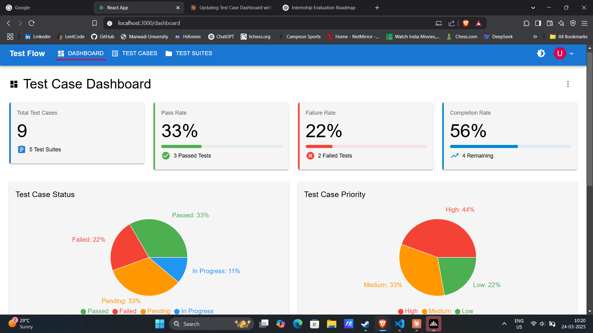
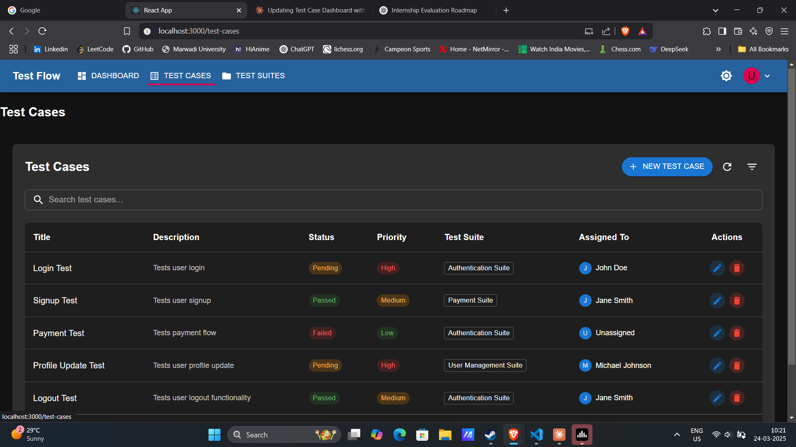
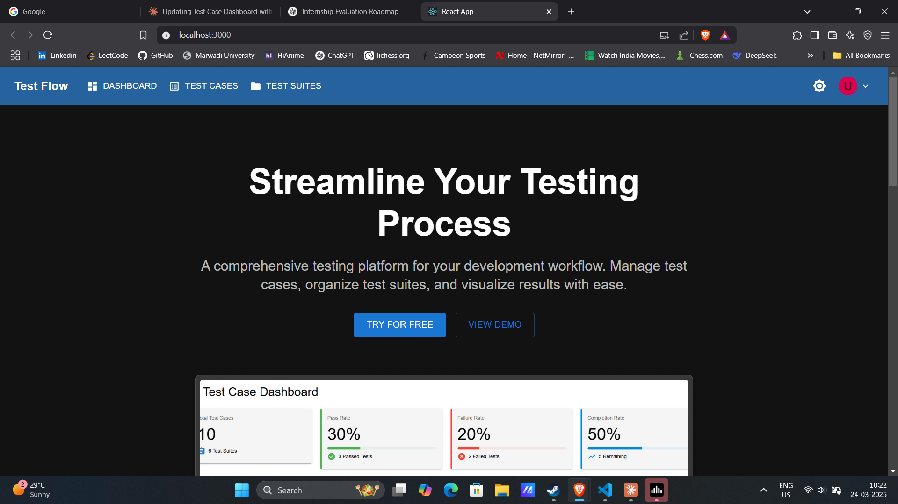

# Test Manager App

A modern web-based tool for managing test cases and test suites. This application helps QA teams organize, execute, and track tests effectively. With a clean, responsive UI built on React, Redux, and Material-UI, it features CRUD operations, search, filtering, sorting, pagination, user assignment, dark mode, and notifications.

---

## Table of Contents

- [Features](#features)
- [Technologies Used](#technologies-used)
- [Requirements](#requirements)
- [Installation](#installation)
- [Usage](#usage)
- [Screenshots](#screenshots)
- [Contributing](#contributing)

---

## Features

- **Test Case Management**
  - Display a list of test cases with:
    - Title
    - Description
    - Execution Status (Pending, In Progress, Passed, Failed)
    - Priority (Low, Medium, High)
    - Associated Test Suite
    - Assigned User
  - CRUD operations for test cases.
  - Pagination, search, filtering, and sorting for efficient navigation.
  - Pop-up notifications (using Material-UI Snackbar) for add, update, and delete actions.

- **Test Suite Management**
  - Display a list of test suites.
  - CRUD operations for test suites.
  - Search functionality.
  - Forms for adding and editing test suites via Material-UI Dialogs.

- **User Assignment**
  - Assign test cases to users using a dropdown in the form.
  - Display assigned user names in the test case list.

- **Dark Mode**
  - Toggle between light and dark themes using Material-UI theme customization.
  - Dark mode state is persisted via `localStorage`.

- **Notifications**
  - Success and error pop-ups using Material-UI Snackbar to provide user feedback.

---

## Technologies Used

- **React.js** (with functional components and hooks)
- **Redux** (for state management)
- **Redux Thunk** (for asynchronous actions)
- **Material-UI (MUI)** (for modern, responsive UI components)
- **React Router** (for client-side routing)
- **json-server** (to simulate a backend API)
- **Recharts** (for charts, if needed)
- **Lucide-react** (for icons)
- **redux-devtools-extension** (for debugging Redux)

---

## Requirements

Before running the project, ensure you have installed:
- **Node.js** (v14 or later)
- **npm** (v6 or later)

The following npm packages will be installed via `npm install`:
- react, react-dom, react-router-dom
- redux, react-redux, redux-thunk
- @mui/material, @mui/icons-material, @emotion/react, @emotion/styled
- recharts, lucide-react
- json-server
- redux-devtools-extension (optional, for debugging)

---

## Installation

1. **Clone the repository:**

   ```bash
   git clone https://github.com/yourusername/test-manager.git
   cd test-manager

2. **Install dependencies:**

   ```bash
   npm install

3. **Set up the Mock API:**

  Make sure you have json-server installed globally (or install it locally):
   ```bash
  npm install -g json-server
  ```
4. **Then, in the project root, run:**

  ```bash
  json-server --watch db.json --port 5000
  ```
## Usage

After installing dependencies and setting up the mock API, follow these steps to use the application:

1. **Start the Mock API:**
   - Open a terminal in the project root and run:
     ```bash
     json-server --watch db.json --port 5000
     ```
   - This will start the mock API at [http://localhost:5000](http://localhost:5000).

2. **Start the Development Server:**
   - In another terminal, run:
     ```bash
     npm start
     ```
   - The app will launch in your browser at [http://localhost:3000](http://localhost:3000).

3. **Navigating the Application:**
   - **Test Cases Page:**
     - View the list of test cases with details like title, description, execution status, priority, associated test suite, and assigned user.
     - Use the search bar to filter test cases by keywords.
     - Utilize filters and sorting options (if enabled) for better organization.
     - Click the **"New Test Case"** button to open a pop-up dialog for adding a new test case.
     - Edit or delete existing test cases using the corresponding action buttons. Notifications will confirm these actions.
   - **Test Suites Page:**
     - Manage test suites with similar functionality: view, search, add, edit, and delete test suites.
   - **User Assignment:**
     - In the Test Case form, assign a test case to a user using the provided dropdown.
   - **Dark Mode:**
     - Toggle between light and dark themes using the dark mode toggle button in the navigation bar.

4. **Notifications:**
   - Pop-up notifications (Snackbars) will appear to inform you of successful add, update, or delete actions, or to alert you when errors occur.

---

## After Installation

Once you have the project up and running, here are some next steps and additional considerations:

- **Customization:**
  - **Theme Customization:** Modify the `theme.js` file (located in the `styles` folder) to change colors, fonts, and other design elements.
  - **API Integration:** Update the API endpoints in the Redux actions if you decide to connect to a real backend service.
  - **Feature Enhancements:** Consider adding additional features like detailed reporting, user roles, or integration with CI/CD pipelines.

- **Deployment:**
  - You can deploy the application on hosting platforms such as **Vercel**, **Netlify**, or **Heroku** for public access.
  - Make sure to update the API endpoints if needed when deploying.

- **Contributing:**
  - Contributions are welcome! Please refer to the [Contributing](#contributing) section for guidelines on how to get started.

- **Screenshots:**
  - Update the screenshots in the repository (under a `screenshots` folder) and the README to reflect the current UI and features.

Enjoy using and enhancing your Test Manager App!

## Screenshots

Here are some screenshots of the Test Manager App:

- **Dashboard:**
  
  
- **Test Cases Page:**
  
  
- **Test Suites Page:**
  
  
- **Dark Mode Example:**
  
  
- **Home**
  

---

## Contributing

Contributions to the Test Manager App are welcome and appreciated! Follow these guidelines to help us improve the project:

1. **Fork the Repository**
   - Click the **Fork** button in the upper-right corner of the repository on GitHub to create a copy under your account.

2. **Clone Your Fork**
   - Clone the forked repository to your local machine:
     ```bash
     git clone https://github.com/yourusername/test-manager.git
     cd test-manager
     ```

3. **Create a New Branch**
   - Create a new branch for your feature or bug fix. Use a descriptive name:
     ```bash
     git checkout -b feature/your-feature-name
     ```

4. **Make Your Changes**
   - Implement your changes while following the project's coding style.
   - If you add new features, consider writing tests to ensure they work as expected.
   - Make sure your changes do not break existing functionality.

5. **Commit Your Changes**
   - Commit your changes with a clear and concise commit message:
     ```bash
     git commit -am "Add: brief description of the feature or fix"
     ```

6. **Push Your Branch**
   - Push your branch to your forked repository:
     ```bash
     git push origin feature/your-feature-name
     ```

7. **Create a Pull Request**
   - Go to the original repository on GitHub.
   - Click the **Compare & pull request** button next to your branch.
   - Fill in the pull request template (if available) or provide a clear description of your changes, the problem they solve, and any additional context.
   - Submit the pull request for review.

8. **Review Process**
   - Your pull request will be reviewed by the project maintainers.
   - You might be asked to make further changes—please address any comments or suggestions.
   - Once approved, your changes will be merged into the project.

9. **Follow the Code of Conduct**
   - Please adhere to the project's [Code of Conduct](./CODE_OF_CONDUCT.md) to ensure a welcoming and respectful environment for all contributors.

Thank you for your interest in contributing to the Test Manager App!


